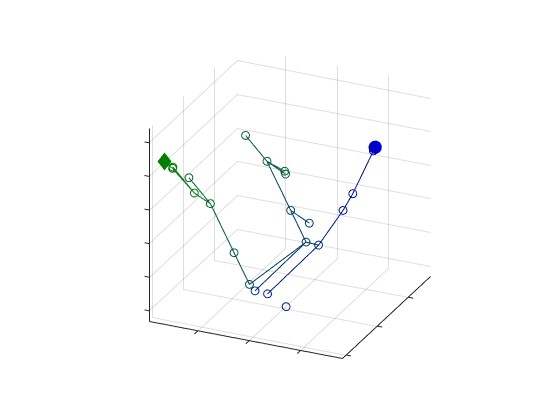

# Visualizing fast-downward, in space!

December Stuart | Sal Choueib

[Using the Fast-Downward planner](https://github.com/aibasel/downward)
[and public planning settings](https://github.com/AI-Planning/classical-domains)



## Structure

`fast-downward-22.12/` contains a modified version of the fast-downward planning 
system. Compilation and useage is as usual, but the planner will write two
additional files:
- `statespace.csv`, which will contain the SAS+ variables at each abstract state
- `relation.csv`, which will contain the state transition information

`classical-planning/` contains a number of classical planning settings

`visualize-replay/` contains the visualization script `replay.m`, as well as a
catalog of the data and figures presented in the report. To run do:
```
>> replay("state_space_file.csv", "state_translation.csv")
```

